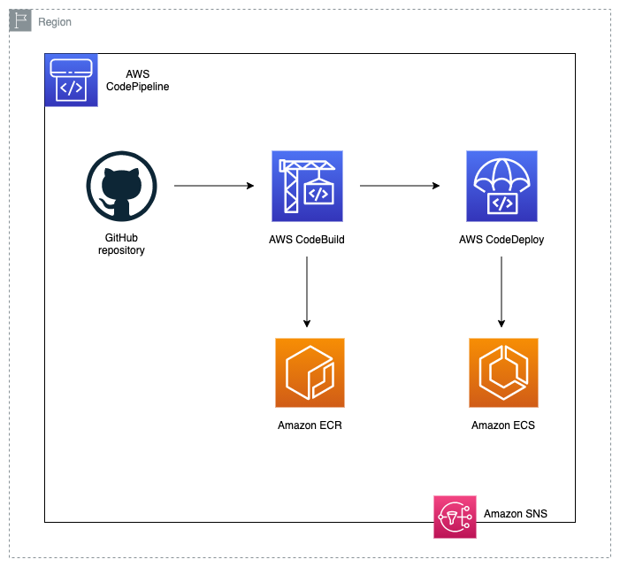

# Spotter Exercise

## Table of contents

- [Solution overview](#solution-overview)
- [General information](#general-information)
- [Application Code](#application-code)
  - [Client app](#client-app)
    - [Client considerations](#client-considerations)
  - [Server app](#server-app)
- [Infrastructure](#infrastructure)
  - [Infrastructure Architecture](#infrastructure-architecture)
    - [Infrastructure considerations](#infrastructure-considerations)
  - [CI/CD Architecture](#cicd-architecture)
  - [Prerequisites](#prerequisites)
  - [Usage](#usage)
  - [Deploying New Code](#deploying-new-code)
  - [Seeding the Database](#seeding-the-database)

To go directly to the code or infrastructure folders, click on the following links:

[Infrastrure](https://github.com/balazss/spotter-exercise/tree/main/infrastructure/README.md) \
[Client app](https://github.com/balazss/spotter-exercise/tree/main/code/client/README.md) \
[Server app](https://github.com/balazss/spotter-exercise/tree/main/code/server/README.md)

## Solution overview

This repository contains **backend** and **frontend** code along with **infrastructure**. It demonstrates a React frontened app and a Node.js/Express backend app working together, deployed on an AWS infrastructure using CI/CD and a Bliue/Green deployment strategy.

## General information

The project has been divided into two parts:

- **code**: the code for the running application
  - **client**: React.js code for the frontend application
  - **server**: Node.js code for the backend application
- **infrastructure**: contains the Terraform code to deploy the needed AWS resources for the solution

## Application Code

### Client app

The **client** folder contains the code to run the frontend. This code is written in React.js and uses port `80` in the deployed version, but when run localy it uses port `3000`.

The application folder structure is separeted in components, contexts, hooks and pages, and some other necessary files like the `Dockerfile` and `package.json`.

_More info:_ [Client app](https://github.com/balazss/spotter-exercise/tree/main/code/client/README.md)

### Client considerations

1. MaterialUI is used to create the UI components with styled components using Emotion.
2. For the icons, FontAwsome is used with SVG icons.

### Server app

The **server** folder contains the code to run the backend. This code is written in Node.js and Express.js and uses port `80` in the deployed version, but when run localy it uses port `4000`.

Swagger was also implemented in order to document the API. The Swagger endpoint is provided as part of the Terraform output, and you can grab the output link and access it through a browser.

The server exposes 3 endpoints:

- /api/health: serves as a dummy endpoint to know if the server is up and running. This one is used as the health check endpoint by the AWS ECS resources
- /api/products: main endpoint, which returns all the Items from an AWS Dynamodb table
- /api/docs: the Swagger enpoint for the API documentation

_More info:_ [Server app](https://github.com/balazss/spotter-exercise/tree/main/code/server/README.md)

## Infrastructure

The **infrastructure** folder contains the terraform code to deploy the AWS resources. The _modules_ folder has been created to store the Terraform modules used in this project. The _templates_ folder contains the different configuration files needed within the modules. The Terraform state is stored locally in the machine where you execute the terraform commands, however, in a real-world environment, a better solution such as Terraform Cloud could be used store the state remotely. The AWS resources created by the script are detailed bellow:

- AWS Networking resources, following best practices for High-Availability (HA):
- 2 ECR Repositories
- 1 ECS Cluster (Fargate)
- 2 ECS Services
- 2 Task definitions
- 4 Autoscaling Policies + Cloudwatch Alarms
- 2 Application Load Balancer (Public facing)
- IAM Roles and policies for ECS Tasks, CodeBuild, CodeDeploy and CodePipeline
- Security Groups for ALBs, ECS tasks, RDS and CodeBuild
- 2 CodeBuild Projects
- 2 CodeDeploy Applications
- 1 CodePipeline pipeline
- 1 S3 Bucket (used by CodePipeline to store the artifacts)
- 1 RDS database (Postgres) used by the backend
- 1 SNS topic for notifications

## Infrastructure Architecture

The following diagram represents the infrastructure architecture being deployed with this project:

<p align="center">
  
</p>

### Infrastructure considerations

1. The task definition template (infrastructure/iemplates/taskdef.json) that enables the CodePipeline to execute a Blue/Green deployment in ECS has hardcoded values for the memory and CPU values for the server and client application.
   Feel free to change it, by adding for example a set of `sed` commands in CodeBuild.

2. Some security best practices have been omitted for the sake of simplicity, such as, the database password exposed in the task definition template, the lack of encryption for the S3 bucket, etc. These should be handled in a real-world production environment.

## CI/CD Architecture

The following diagram represents the CI/CD architecture being deployed with this project:

<p align="center">
  
</p>

## Deploying New Code

CodePipeline will automatically deploy new code when a new commit is pushed to the `main` branch. You can also manually deploy new code by following these steps:

1. Go to the AWS CodePipeline service and select the pipeline created by this Terraform code.
2. Click on the _Release change_ button.

This above will deploy the current code in the `main` branch.

_More info:_ [Infrastrure](https://github.com/balazss/spotter-exercise/tree/main/infrastructure/README.md)

## Seeding the Database

The database is seeded with the data provided in the exercise. You can seed the database by following these steps:

1. Download and install **AWS CLI** [Install AWS CLI](https://docs.aws.amazon.com/cli/latest/userguide/getting-started-install.html)
2. Configure AWS CLI with your credentials [Configure AWS CLI](https://docs.aws.amazon.com/cli/latest/userguide/getting-started-quickstart.html)
3. Grab the _cluster name_, _task ARN_ and _container name_ from your ECS console. You can find them in the _Cluster_ and _Tasks_ sections in the AWS ECS Console, respectively.
4. Run the following commands to seed the database:

```bash
aws ecs execute-command --region <YOUR_REGION> --cluster Cluster-prod --task <YOUR_TASK_ARN> --container <YOUR_CONTAINER_NAME> --command "npx prisma db seed"
```

An example command looks like this:

```bash
aws ecs execute-command --region us-west-2 --cluster Cluster-prod --task arn:aws:ecs:us-west-2:671092380128:task/Cluster-prod/2a42c78d0cff49398ec67b3dd10e97f4 --container Container-server --command "npx prisma db seed"
```
